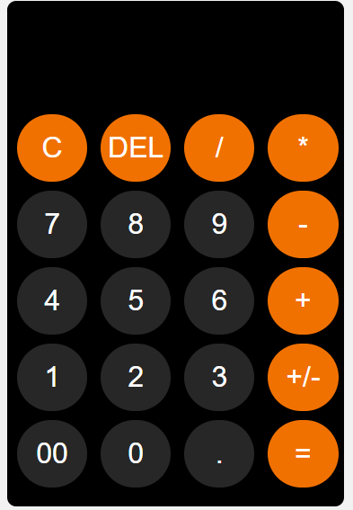

# 🧮 Calculator

A simple calculator built using HTML, CSS, and JavaScript.

## 🌐 Live Demo
https://anjali-singhal-code.github.io/calculator/

## 📸 Screenshot

## 🚀 Features
- ➕ Addition
- ➖ Subtraction
- ✖ Multiplication
- ➗ Division
- Clean UI
- Responsive design

## 🛠️ Technologies Used
- HTML
- CSS
- JavaScript

## ▶️ How to Run
Open index.html in browser

---

💡 Beginner frontend project
